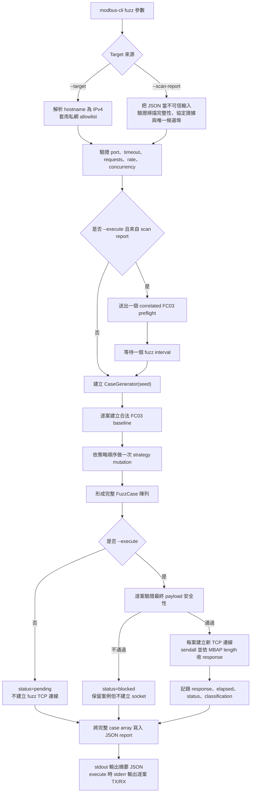

# Modbus Lab CLI Fuzz 封包產生機制完整報告

> 分析對象：`modbus-lab-cli` 0.2.0
>
> 報告範圍：Modbus/TCP fuzz 封包的目標、原理、產生方法、執行流程、安全邊界、結果判讀與限制
>
> 分析基準：目前工作目錄中的實際程式碼；程式行為與說明文件不一致時，以程式碼為準
>
> 驗證環境：專案 `.venv` 的 Python 3.12；完整測試結果為 `135 passed`

---

## 1. 執行摘要

這個專案的 fuzz 核心不是從任意長度的隨機位元組開始，也不是直接對 PLC 連續灌入完全未知
資料。它採用的是**以合法封包為基礎的、結構感知的 deterministic mutation fuzzing**：

1. 先建立一個固定格式、合法且唯讀的 Modbus/TCP FC03 request：
   - Transaction ID：依案例編號產生。
   - Protocol ID：`0`。
   - MBAP Length：`6`。
   - Unit ID：由使用者指定，預設 `1`。
   - Function Code：`3`，即 Read Holding Registers。
   - Address：`0`。
   - Quantity：`1`。
2. 再依使用者指定的策略，修改封包中的 quantity、MBAP length、function code、transaction
   ID、unit ID，或隨機翻轉 bit/byte。
3. 使用固定 seed 的獨立 PRNG，使相同參數與相同策略順序能重建相同案例。
4. 預設只把案例寫成 JSON corpus，不連線。
5. 只有加入 `--execute` 才進入主動執行路徑；每個突變後 payload 在建立 socket 前還會再次
   經過唯讀功能碼與 MBAP framing 安全檢查。
6. 通過檢查的案例會循序執行，每個案例建立一條新的 TCP 連線；回應、延遲、transport
   狀態與保守分類會寫回報告。

因此，這個工具實際上同時保留了兩種測試面：

- **離線 corpus 測試面**：可保留畸形 length、未知功能碼、可能成為寫入功能碼的案例，適合
  測試 decoder、parser 或供人工審查。
- **主動網路測試面**：只允許能在傳輸邊界被確認為單一完整、明確唯讀 Modbus/TCP ADU
  的案例。

這項設計的主要目標是讓 fuzz 測試具備可重現性、可審查性與保守的實驗室安全邊界，而不是
最大化任意封包覆蓋率。

---

## 2. 專案目標與定位

### 2.1 主要目標

依專案描述、CLI 行為與安全策略，fuzz 子系統主要希望完成以下工作：

1. **測試 Modbus/TCP 實作對異常輸入的健壯性**
   - 邊界與越界 quantity。
   - 不一致的 MBAP length。
   - 非典型 transaction ID 與 unit ID。
   - function code 變異。
   - 位元、位元組與隨機 byte replacement。
   - address/quantity 組合的語意邊界。

2. **讓測試案例可重現**
   - 報告記錄 seed、策略、目標、request hex 與 mutation。
   - 相同程式版本、seed、策略順序、案例數和 Unit ID 可重建相同 corpus。

3. **把產生與傳送分離**
   - `fuzz` 預設只產生案例。
   - `fuzz --execute` 才會傳送。
   - 產生器本身不開 socket，網路 I/O 由 executor 與 transport 負責。

4. **限制主動測試風險**
   - 預設只允許 loopback 與 RFC1918 私有 IPv4 目標。
   - 限制案例數、速率與 concurrency 參數。
   - 突變後 payload 在最後傳輸邊界重新判定，不信任「原始基準封包是唯讀」這項前提。
   - 寫入、未知功能碼、畸形或串接 ADU 不會由 fuzz/replay 路徑送出。

5. **整合 PLC 掃描證據**
   - 可從 scan report 選取已確認的 Modbus/TCP endpoint。
   - 不以「502 埠開放」直接推定服務就是 Modbus。
   - report-driven execution 會在第一個 fuzz case 前再做一次 FC03 correlation preflight。

### 2.2 非目標

目前實作不是以下類型的 fuzzer：

- 不是 coverage-guided fuzzer，例如 AFL++ 或 libFuzzer。
- 不是 grammar generator；它不會依完整 Modbus 規格產生所有 PDU 結構。
- 不是 stateful protocol fuzzer；案例彼此獨立，不維持同一 TCP session 或應用狀態。
- 不是漏洞自動確認器；timeout、disconnect 或 parser warning 都不是 CVE 結論。
- 不是完整 delta-debugger；`minimize` 只做固定長度裁切。
- 不是 Modbus RTU、ASCII、TLS 或 serial fuzzer；目前主動 transport 只有 Modbus/TCP。
- 不是 process-safety 或授權控制系統；操作員仍須自行確認測試授權與實體製程安全。

---

## 3. 相關模組與責任分工

| 模組 | 主要責任 | 與 fuzz 的關係 |
| --- | --- | --- |
| [`src/modbus_cli/cli.py`](../src/modbus_cli/cli.py) | 解析 CLI、驗證參數、組合工作流、輸出摘要 | 決定策略順序、案例數、seed、target、是否執行 |
| [`src/modbus_cli/protocol.py`](../src/modbus_cli/protocol.py) | MBAP/PDU 編碼與 best-effort 解碼 | 建立合法 FC03 baseline，解析 request/response |
| [`src/modbus_cli/fuzzing.py`](../src/modbus_cli/fuzzing.py) | 案例資料模型、九種 mutation、執行、分類、JSON 保存 | fuzz 核心 |
| [`src/modbus_cli/safety.py`](../src/modbus_cli/safety.py) | 私網 target policy、案例數、速率與 concurrency 上限 | CLI 前置安全限制 |
| [`src/modbus_cli/workflow.py`](../src/modbus_cli/workflow.py) | 從 scan report 安全選取 endpoint、執行 FC03 preflight | scan → fuzz 的信任邊界 |
| [`src/modbus_cli/transport.py`](../src/modbus_cli/transport.py) | TCP connect、sendall、依 MBAP length 收取 response | 每個可執行案例的網路 I/O |
| [`src/plcfp/probes/modbus.py`](../src/plcfp/probes/modbus.py) | 掃描階段的唯讀 Modbus 主動探測與 response correlation | 產生 scan report 中的協定證據 |
| [`src/plcfp/port_services.py`](../src/plcfp/port_services.py) | 將協定證據轉成 confirmed/fuzz-eligible finding | 避免只靠埠號選取 fuzz 目標 |

整體架構刻意把「封包編碼」、「案例突變」、「網路傳輸」、「掃描證據」和「CLI 呈現」分開。
這讓離線 fuzz corpus generation 可以不接觸網路，也讓最後一層安全檢查能直接針對實際
payload，而不是依賴上游策略名稱。

---

## 4. Modbus/TCP 封包基礎

### 4.1 ADU 結構

本專案處理的是 Modbus/TCP ADU。封包由 7-byte MBAP header 加上 PDU 組成：

| Offset | 長度 | 欄位 | Baseline 值 | 說明 |
| ---: | ---: | --- | --- | --- |
| 0–1 | 2 bytes | Transaction ID | 案例編號 | 用於 request/response 配對 |
| 2–3 | 2 bytes | Protocol ID | `0x0000` | Modbus/TCP 固定為 0 |
| 4–5 | 2 bytes | Length | `0x0006` | 從 Unit ID 起算的 byte 數 |
| 6 | 1 byte | Unit ID | 預設 `0x01` | Gateway 後端設備或邏輯單元編號 |
| 7 | 1 byte | Function Code | `0x03` | Read Holding Registers |
| 8–9 | 2 bytes | Address | `0x0000` | 零起算位址 |
| 10–11 | 2 bytes | Quantity | `0x0001` | 讀取一個 register |

Modbus/TCP 不使用 Modbus RTU 的 CRC；完整性與傳輸可靠性由 TCP 負責。

### 4.2 Baseline request

案例編號為 1、Unit ID 為 1 時，基準封包是：

```text
0001 0000 0006 01 03 0000 0001
│    │    │    │  │  │    └─ Quantity = 1
│    │    │    │  │  └────── Address = 0
│    │    │    │  └───────── Function = FC03
│    │    │    └──────────── Unit ID = 1
│    │    └───────────────── Length = 6
│    └────────────────────── Protocol ID = 0
└─────────────────────────── Transaction ID = 1
```

合併後為：

```text
000100000006010300000001
```

建立過程如下：

1. `CaseGenerator.generate()` 呼叫 `encode_adu(3, 0, 1, ...)`。
2. `encode_pdu()` 將 FC03、address 0、quantity 1 以 big-endian `>BHH` 編碼為 5-byte PDU：
   `03 0000 0001`。
3. `encode_adu()` 將 `len(PDU) + 1` 設為 MBAP Length，因此 length 是 6。
4. `MBAPHeader.encode()` 以 big-endian `>HHHB` 編碼 7-byte header。
5. Header 與 PDU 串接成固定 12-byte baseline。

值得注意的是：正常的 `encode_pdu()` 會拒絕 FC03 quantity 0 或大於 125；fuzzer 是先用
合法 quantity 1 通過 encoder，再直接修改已編碼的 `bytearray`，因此可以產生正常 builder
不允許建立的異常值。

---

## 5. Fuzz 封包產生演算法

### 5.1 輸入參數

主要輸入如下：

| 參數 | 預設值 | 作用 |
| --- | ---: | --- |
| `--target` / `--scan-report` | 二選一 | 決定 target host 與 port |
| `--port` | direct target 時為 502 | 目的 TCP 埠，或從多個 scan candidate 中消歧義 |
| `--unit-id` | 1 | baseline 的 Unit ID |
| `--strategy` | `boundary` | 可重複指定，依指定順序循環 |
| `--requests` | 100 | 產生的 fuzz case 數量 |
| `--seed` | 1 | PRNG seed |
| `--rate` | 10 requests/s | 執行節奏 |
| `--interval` | 無 | 若指定，取代 rate，直接表示相鄰案例等待秒數 |
| `--concurrency` | 1 | 只做上限驗證；目前執行器仍是 sequential |
| `--execute` | false | 是否真正傳送 |
| `--output` | `artifacts/fuzz-report.json` | 完整 case array |

### 5.2 策略排程

若沒有指定 `--strategy`，實際策略清單為：

```python
["boundary"]
```

若重複指定：

```bash
--strategy boundary --strategy semantic --strategy length
```

則第 1、2、3、4、5、6 個案例的策略依序為：

```text
boundary, semantic, length, boundary, semantic, length
```

程式使用以下概念選取策略：

```python
strategy = strategies[case_zero_based_index % len(strategies)]
```

### 5.3 案例編號與 Transaction ID

CLI 傳入 `i + 1`，所以第一個 case index 是 1。Baseline transaction ID 使用：

```python
transaction_id = index & 0xFFFF
```

同時案例 ID 為六位補零格式：

```text
case-000001
case-000002
...
```

目前 `--requests` 上限是 10,000，因此一般 CLI 使用不會走到 16-bit transaction ID wrap。

### 5.4 PRNG 狀態

每次 fuzz command 只建立一個：

```python
random.Random(seed)
```

所有案例共用同一個 generator instance，因此 PRNG 狀態會隨案例依序前進。這表示某案例的
輸出不只取決於它自己的策略，也取決於前面策略消耗了多少次亂數。

### 5.5 突變與封裝

每個案例都重新建立一份合法 FC03 baseline，再執行一種策略。突變後封包被轉成大寫 hex，
連同 metadata 放入 `FuzzCase`：

```text
case_id
seed
strategy
target
request_hex
mutations
sent_at
response_hex
elapsed_ms
status
classification
reproducible
safety_reason
```

離線模式建立完成後直接保存；主動模式則先執行所有案例，再保存更新後的結果。

### 5.6 簡化偽程式碼

```python
validate_target_and_limits()
strategies = user_strategies or ["boundary"]
generator = CaseGenerator(seed)

cases = []
for index in range(1, requests + 1):
    strategy = strategies[(index - 1) % len(strategies)]
    packet = encode_valid_fc03_baseline(
        transaction_id=index & 0xFFFF,
        unit_id=unit_id,
        address=0,
        quantity=1,
    )
    mutate(packet, strategy, generator.random)
    cases.append(FuzzCase(...))

if execute:
    for case in cases:
        if payload_is_not_safe_read_only_single_adu(case):
            mark_blocked(case)
            continue
        result = tcp_exchange(case)
        classify(result)

save_json(cases)
```

---

## 6. 二十二種 mutation strategy 詳解

### 6.1 總表

| Strategy | 修改位置 | 候選值或動作 | 主要測試面 | 主動執行可能性 |
| --- | --- | --- | --- | --- |
| `boundary` | bytes 10–11 | `0, 1, 124, 125, 126, 127, 128, 255, 65535` | FC03 quantity 邊界與越界處理 | MBAP 與 FC 仍合法，會通過安全閘 |
| `bitflip` | 任一 byte 的任一 bit | 一次 XOR | 廣泛單 bit fault | 視實際落點決定 |
| `byteflip` | 任一 byte | XOR `0xFF` | 整個 byte 反相 | 視實際落點決定 |
| `length` | bytes 4–5 與 ADU 大小 | `2, 3, 5, 7, 8, 12, 253, 254`；截斷或延伸 PDU 並保持 MBAP length 一致 | 截斷/延伸 PDU 的長度處理 | framing 合法，會通過 |
| `function-code` | byte 7 | `0, 7, 43, 127, 128, 255` | 未知、保留、例外位元與非典型 FC | 實際上通常只有 FC07 可能通過 |
| `transaction` | bytes 0–1 | `0, 1, 65535` | Transaction ID 邊界與配對行為 | 會通過 |
| `unit-id` | byte 6 | `0, 1, 247, 248, 255` | Unit ID 邊界、保留與 gateway 行為 | 會通過 |
| `semantic` | bytes 8–11 | 三組固定 address/quantity | 邏輯邊界與不一致參數 | FC03 與 framing 合法，會通過 |
| `random` | 任意 1–4 個 byte | 每次以 0–255 替換 | 混合、非定向 mutation | 視最終 payload 決定 |
| `huge-payload` | 整個 ADU | FC16 quantity 200–2000，byte_count wrap | oversized write payload 的解析與資源處理 | 會通過（虛擬實驗室邊界） |
| `protocol-id` | bytes 2–3 | `1, 255, 256, 65535`、隨機非零值 | Protocol ID 驗證與閘道轉送行為 | 會通過 |
| `address-wrap` | bytes 8–11 | `0xFFFE+4`、`0xFFFF+1` 等溢位組合 | 暫存器映射邊界的整數溢位 | framing 合法，會通過 |
| `truncated-mbap` | 整個 ADU | 只保留 1–6 bytes | 不完整 header 的 partial-read 狀態機 | 會通過（非空） |
| `concatenated-adu` | ADU 尾部 | 串接合法/垃圾/截斷第二幀 | pipelining 與 framing resync | 會通過 |
| `pdu-mismatch` | PDU + length 重算 | FC15/FC16 byte_count 不符、FC05 非法 toggle、FC03 trailing bytes | 解析器欄位交叉驗證 | framing 合法，會通過 |
| `exception-shape` | PDU 重建 | FC `0x81/0x83/0x90` + exception code | request/response 混淆 | framing 合法，會通過 |
| `mei-subtype` | PDU 重建 | FC43 MEI `0x0D/0x0E` 變體與截斷 | FC43 多工層、含寫入能力的 MEI 0x0D | framing 合法，會通過 |
| `rtu-over-tcp` | 整個 ADU | RTU frame（含正確 CRC16）經 TCP | RTU/TCP 閘道混淆 | 會通過 |
| `fill` | bytes 6–11 | 全部 `0x00` 或 `0xFF` | 全零/全一輸入的 null-deref 類 bug | framing 合法，會通過 |
| `fragmented-send` | 傳輸方式 | ADU 拆 2–3 段、段間延遲 0.05–1.0s | partial frame reassembly 與執行緒持有 | 會通過（單一連線多步） |
| `repeat-storm` | 傳輸方式 | 單一連線連發 3–20 次 | server 端狀態/資源累積 | 會通過（單一連線多步） |
| `session-sequence` | 傳輸方式 | 合法→畸形→合法 序列 | 跨請求狀態污染 | 會通過（單一連線多步） |

### 6.2 `boundary`

程式直接覆寫 FC03 quantity：

```python
packet[10:12] = value.to_bytes(2, "big")
```

候選集合：

```text
0, 1, 124, 125, 126, 127, 128, 255, 65535
```

對 FC03 而言，協定 encoder 接受的 quantity 是 1–125，所以：

- `1`、`124`、`125` 是合法值或合法上界附近。
- `0` 是下界以下。
- `126`、`127`、`128` 是剛超過上界的連續區域。
- `255` 和 `65535` 是較大的 byte/uint16 邊界。

此策略不改 MBAP length 或 function code，所以即使 quantity 不符合 FC03 規格，封包仍是
一個 framing 完整、功能碼為唯讀 FC03 的 ADU，主動安全閘會允許送出。這正是專案最主要的
主動 fuzz 測試面。

### 6.3 `bitflip`

演算法：

```python
position = rng.randrange(len(packet))  # 0..11
bit = rng.randrange(8)                 # 0..7
packet[position] ^= 1 << bit
```

它可能命中任何欄位：

- Transaction ID。
- Protocol ID。
- MBAP Length。
- Unit ID。
- Function Code。
- Address。
- Quantity。

如果命中 protocol ID、length、function code，最終案例可能被主動安全閘封鎖；若只改
transaction、unit、address、quantity，通常仍可執行。

### 6.4 `byteflip`

演算法：

```python
position = rng.randrange(len(packet))
packet[position] ^= 0xFF
```

被選到的 byte 會逐 bit 反相。例如 Unit ID `0x01` 會變成 `0xFE`。它比單 bit flip 產生的
偏差更大，但仍只改一個 byte。

### 6.5 `length`

此策略調整 ADU 的實際大小，並讓 MBAP Length 與調整後的 unit-and-PDU 大小一致：

```python
value = rng.choice((2, 3, 5, 7, 8, 12, 253, 254))
target_size = 6 + value
if target_size < len(packet):
    del packet[target_size:]
elif target_size > len(packet):
    packet.extend(rng.randrange(256) for _ in range(target_size - len(packet)))
packet[4:6] = value.to_bytes(2, "big")
```

候選值：

```text
2, 3, 5, 7, 8, 12, 253, 254
```

- 比基準 12 bytes 短的值（2、3、5）會截斷 PDU，測試目標如何處理缺欄位的短 PDU。
- 比基準長的值（7、8、12、253、254）會以隨機 bytes 延伸 PDU，測試目標如何處理多餘
  trailing data。
- 所有案例的 `declared_length` 都在 2..254 且與實際大小一致，framing 合法，保證能
  送出，真正測到目標的長度處理邏輯。

（舊版只覆寫 length 欄位為 `0, 1, 5, 7, 65535`，framing 必定不一致，在嚴格安全閘
下會全部被封鎖，測不到任何東西，因此改為目前的調整大小設計。）

### 6.6 `function-code`

此策略把 byte 7 改成：

```text
0x00, 0x07, 0x2B, 0x7F, 0x80, 0xFF
```

各值的執行結果：

- `0x00`：不在 read-only allowlist，封鎖。
- `0x07`：Read Exception Status，位於 allowlist；一般會通過。
- `0x2B`：FC43 是 multiplexed function。產生器只改 function byte，後面仍保留原 FC03 的
  `00 00 00 01`，不符合安全閘要求的完整 `2B 0E <read-device-id-code> <object-id>` 四 byte
  PDU，因此封鎖。
- `0x7F`：不在 allowlist，封鎖。
- `0x80`：不在 allowlist，封鎖。
- `0xFF`：不在 allowlist，封鎖。

FC07 雖然通過 read-only allowlist，但封包仍有 FC03 baseline 遺留的四個 data bytes。
安全閘沒有對 FC07 做精確 PDU shape 驗證，因此這個案例可用來測試 target 對「唯讀功能碼
加上非預期尾隨 PDU 資料」的處理。

### 6.7 `transaction`

覆寫 Transaction ID：

```text
0, 1, 65535
```

它測試 transaction ID 的最小值、常用值與 uint16 最大值。此策略不破壞 MBAP framing 或
唯讀 FC03，因此會通過安全閘。

每個案例使用新 TCP 連線，fuzz executor 也不會檢查 response transaction ID 是否與 request
一致，所以這項策略主要觀察 target 是否正常回應；要確認錯誤配對，仍須人工比較 request 與
response。

### 6.8 `unit-id`

覆寫 Unit ID：

```text
0, 1, 247, 248, 255
```

它涵蓋常見值、一般設備位址上界附近及較特殊值。安全閘不封鎖這些 uint8 值，因此它們可被
主動送出。實際意義依 direct Modbus/TCP server、TCP-to-serial gateway 或設備實作而異。

### 6.9 `semantic`

此策略一次覆寫 address 與 quantity：

```text
FFFF 0002  # address=65535, quantity=2
FFFF FFFF  # address=65535, quantity=65535
0000 0000  # address=0,     quantity=0
```

這三種組合分別測試：

- 位址位於 uint16 上限，讀取範圍跨越地址空間末端。
- 位址與數量同時使用 uint16 最大值。
- quantity 為 0。

它們保持 Protocol ID、MBAP length 與 FC03 不變，所以會通過主動安全閘。

### 6.10 `random`

流程：

```python
for _ in range(rng.randint(1, 4)):
    position = rng.randrange(len(packet))
    packet[position] = rng.randrange(256)
```

特性：

- 每個案例做 1–4 次 replacement。
- 每次都可能選到 12-byte packet 中任一位置。
- 同一位置可能在同一案例中被選中多次。
- 新值可能剛好等於舊值，因此不保證每次 replacement 都造成最終差異。
- mutation log 只記錄 `replace:<position>`，不記錄舊值與新值。
- 最終可能成為唯讀、寫入、未知功能碼或畸形 framing；是否傳送由最後安全閘決定。

### 6.11 `huge-payload`

透過 `build_huge_payload()` 產生舊腳本的 FC16 Write Multiple Registers malformed payload：
quantity 200–2000、實際 body 為 `quantity * 2` bytes、1-byte `byte_count` 依舊 wrap，
MBAP length 宣告完整 oversized PDU。這是虛擬實驗室可靠性探針，不屬於任何
vulnerability case。

### 6.12 `protocol-id`

覆寫 MBAP Protocol ID（bytes 2–3）：

```python
value = rng.choice((1, 0xFF, 0x100, 0xFFFF, rng.randrange(1, 0x10000)))
packet[2:4] = value.to_bytes(2, "big")
```

Modbus/TCP 規定 Protocol ID 必為 0，但許多 OT 設備不驗證，或對非零值進入未測試的
解析分支；閘道器甚至可能把它轉送給後端串口設備。

### 6.13 `address-wrap`

覆寫 FC03 的 start address 與 quantity，專門測「起點 + 數量」的算術溢位：

```text
(0xFFFE, 4), (0xFFFF, 1), (0xFFFF, 2), (0xFFF0, 0x20), (0, 0), (0x8000, 0x8000)
```

`boundary` 只改 quantity；`address-wrap` 補上暫存器映射邊界檢查中最經典的
`start + quantity - 1` 溢位（繞回 0 附近）這個 crash 向量。framing 與功能碼維持合法。

### 6.14 `truncated-mbap`

只保留封包前 1–6 bytes：

```python
keep = rng.choice((1, 2, 3, 4, 5, 6))
del packet[keep:]
```

送出不完整的 MBAP header，測試 server 的 partial-read 狀態機：緩衝區處理、連線占用、
執行緒掛起（CVE-2025-53476 同族的連線持有問題）。非空 payload，安全閘不會封鎖。

### 6.15 `concatenated-adu`

在一個 TCP segment 內串接第二個 frame：

- `valid`：另一個合法 FC03 ADU（不同 transaction ID）。
- `garbage`：4–16 bytes 隨機資料。
- `truncated`：基準 ADU 的前 1–7 bytes。

測試 pipelining 與 framing resync——OT 閘道器與代理最常出錯的位置：第一個 ADU 正常
回應後，第二個可能觸發解析錯亂。

### 6.16 `pdu-mismatch`

重建 PDU 並重算 MBAP length（framing 保持一致），專測解析器的欄位交叉驗證：

| variant | 內容 |
| --- | --- |
| `fc16-short-byte-count` | quantity 4 但 byte_count 2（資料不足） |
| `fc16-long-byte-count` | quantity 1 但 byte_count 8（資料過多） |
| `fc15-bit-count-mismatch` | 9 coils 應需 2 bytes 但 byte_count 1 |
| `fc05-invalid-toggle` | FC05 toggle 值非 `0x0000/0xFF00` |
| `fc03-trailing-garbage` | FC03 PDU 尾端多 2 bytes 垃圾 |

與 `huge-payload` 同族但為小封包版本，不會先被「封包太大」這層擋掉。

### 6.17 `exception-shape`

構造外型為 exception response 的 request：

```python
function = rng.choice((0x81, 0x83, 0x90))
code = rng.choice((1, 2, 3, 4, 6, 11, rng.randrange(12, 256)))
pdu = bytes((function, code))
```

測試 request/response 混淆：某些 stack 會把 exception bit 封包送進 response 處理路徑。
framing 一致（length 3）。

### 6.18 `mei-subtype`

FC43 多工傳輸層的 MEI 變體：

| variant | 內容 |
| --- | --- |
| `canopen-write` | MEI `0x0D`（CANopen，**具寫入能力**）+ 2 bytes |
| `invalid-read-code` | MEI `0x0E` 搭配非法 read code（0、5、0xFF） |
| `truncated` | 只有 FC + MEI 兩個 byte |
| `invalid-mei` | 非法 MEI（0x00、0x7F、0xFF） |

FC43/MEI 0x0D 可寫 CANopen 物件，是真實攻擊面；只在可捨棄虛擬環境使用。

### 6.19 `rtu-over-tcp`

把 Modbus RTU frame（unit + FC03 + address + quantity + **正確 CRC16**）直接經 TCP 送出，
不含 MBAP header：

```python
rtu = struct.pack(">BBHH", unit_id, 3, 0, 1)
packet = rtu + struct.pack("<H", _crc16_modbus(rtu))
```

測試 RTU/TCP 閘道混淆：OT 環境大量存在 RTU↔TCP 轉換器，錯誤的 frame 辨識可能讓指令
被轉送到串口匯流排。

### 6.20 `fill`

Unit ID + PDU 六個 byte 全部填充 `0x00` 或 `0xFF`（MBAP length 維持 6，framing 合法）。
全零/全一輸入經常觸發 null-deref、未初始化讀取類 bug；`random` 策略幾乎不可能碰巧
生成這種輸入。

### 6.21 `fragmented-send`

不改封包內容，改**傳輸方式**：generator 在案例附上 `send_plan`，executor 把一個 ADU
拆成 2–3 段 TCP write，段間延遲 0.05–1.0 秒：

```python
send_plan = {"mode": "fragmented", "segments": [...], "delay_seconds": delay}
```

測試 server 的 partial frame reassembly：為等剩餘 bytes 而占用執行緒/緩衝區的
slow-loris 式情境，直接對應 CVE-2025-53476 類的連線持有問題。

### 6.22 `repeat-storm`

同一 payload 在**單一連線**連發 3–20 次，之後在剩餘 timeout 內盡量讀取回應：

```python
send_plan = {"mode": "repeat", "count": N}
```

測試 server 端狀態累積：記憶體/FD 是否隨重複請求成長。`execution.steps` 記錄實際
送出次數與收到的回應數，回應數少於送出次數本身就是退化訊號。

### 6.23 `session-sequence`

單一連線依序送出「合法 FC03 → 畸形 → 合法 FC03」三個 payload，每步各讀一次回應：

```python
send_plan = {"mode": "session", "payloads": [valid, middle, valid]}
```

middle 變體：`garbage`（4–12 bytes 隨機）、`truncated`（1–7 bytes 部分 ADU）、
`exception`（exception-shape ADU）。測試跨請求狀態污染：真實 OT client 都是長連線，
前一個畸形封包是否讓後續合法請求失敗，是單封包架構測不到的面向。每步的
request/response 記錄在 `execution.steps`。注意 TCP stream 語意下，若 middle 無回應，
其後的 read 會消費下一個回應——判讀時以「最後一個合法 FC03 是否仍有回應」為準。

---

## 7. Deterministic 與可重現性的實際條件

專案透過 `random.Random(seed)` 和固定策略排程達到 deterministic generation。測試套件會
建立兩個相同 seed 的 generator，確認二十二種策略依序輸出的 `request_hex` 完全相同。

要重建同一組 request，至少必須保持：

1. 相同程式碼版本。
2. 相同 Python 亂數行為。
3. 相同 seed。
4. 相同策略清單及順序。
5. 相同案例數，或至少保留相同前綴序列。
6. 相同 Unit ID。
7. 相同案例起始 index 與生成順序。

其中策略順序非常重要。不同策略會消耗不同數量的亂數：

- `boundary` 通常消耗一次 choice。
- `bitflip` 消耗 position 與 bit。
- `random` 先決定 mutation 次數，再為每次 mutation 決定 position 與 value。
- `transaction`、`unit-id` 等也各自消耗一次 choice。

因此，只在前面插入一個策略，就可能改變後續所有案例的 PRNG 狀態。

Target host 與 port 會寫進 case metadata，但不參與 payload 的亂數計算。若其他生成參數
相同，只改 host/port，`request_hex` 仍相同。

`--execute` 不會讀取先前人工審查的 fuzz corpus；它會依本次 CLI 參數重新產生案例。
所以審查與執行之間除了 seed，還必須保持 scan report、Unit ID、策略順序、案例數和程式版本
一致。

---

## 8. 從 CLI 到報告的完整資料流



有一個容易忽略的順序：使用 scan report 且加入 `--execute` 時，preflight 發生在 fuzz cases
建立前；preflight 失敗會直接終止，不產生或傳送 fuzz cases。

---

## 9. Target 選取與 scan-to-fuzz 原理

### 9.1 Direct target

直接使用 `--target` 時：

1. `socket.gethostbyname()` 解析成單一 IPv4。
2. 只接受：
   - `127.0.0.0/8`
   - `10.0.0.0/8`
   - `172.16.0.0/12`
   - `192.168.0.0/16`
3. Report 與 transport 使用解析後的 IP，而不是原 hostname。
4. 預設 port 為 502。
5. Direct `--execute` 不會執行 scan-report correlation preflight。

即使沒有 `--execute`，target 仍會被解析並驗證，因為它會寫進 corpus。

### 9.2 Scan report target

`--scan-report` 不會盲目信任 JSON 中自稱的結果。它要求：

1. 頂層必須是 JSON object。
2. `resolved_address` 是非空字串，且重新通過私網 policy。
3. `port_findings` 必須是 array。
4. `status` 必須是已知終態：
   - `complete`
   - `INCONCLUSIVE`
   - `CONFLICT`
   - `FORKED`
5. `BUDGET_EXCEEDED` 明確拒絕。
6. `port_summary.scan_complete` 必須為 `true`。
7. Candidate finding 必須同時符合：
   - `state == "open"`
   - `service_id == "modbus-tcp"`
   - `identification == "confirmed"`
   - `fuzz_eligible is True`
8. 同一 port 還必須有一筆交叉綁定的 observation：
   - `probe_id` 以 `modbus.` 開頭。
   - `state == "observed"`。
   - metadata port 與 candidate 相同。
   - `transport == "tcp"`。
   - `service_id == "modbus-tcp"`。
   - `protocol_valid is True`。
9. 沒有 candidate 時 fail closed。
10. 多個 candidate 時必須用 `--port` 明確選取，不會自行猜測。

這套條件將「常見埠號」、「TCP 開放」、「配置角色」與「應用層協定確認」分開。只有收到
結構有效且與該 TCP port 綁定的 Modbus response，才會標成 fuzz-eligible。

### 9.3 Report-driven FC03 preflight

若使用 `--scan-report --execute`，會先傳送：

```text
C0DE 0000 0006 <UNIT> 03 0000 0001
```

條件如下：

- 固定 Transaction ID：`0xC0DE`。
- Protocol ID：0。
- 使用 fuzz 命令指定的同一 Unit ID。
- FC03，address 0，quantity 1。
- response transaction ID、Protocol ID、Unit ID、MBAP length 都必須吻合。
- 接受兩種 response：
  - 正常 FC03 response，byte count 為 2，且恰好含一個 register。
  - FC03 exception response：FC `0x83`；目前實作接受 exception code 1–11。
- 會拒絕原樣 echo、錯誤 transaction、錯誤 Unit ID、錯誤 function 或不一致 framing。

合法 exception 也能通過，所以 preflight 證明的是「目前 endpoint 仍能產生與 request
相關聯的 Modbus response」，不是 address 0 一定有效，也不是設備目前完全健康。

成功後會等待一個 fuzz interval，再執行第一個 case。這個 preflight 不計入 `--requests`，
所以 report-driven execution 的網路 request 上限是：

```text
1 個 preflight + N 個實際通過安全閘的 fuzz cases
```

---

## 10. 主動執行前的安全邊界

### 10.1 資源限制

預設 policy：

| 項目 | 限制 |
| --- | ---: |
| Fuzz cases | 1–10,000 |
| 最大 rate | 50 requests/second |
| 預設 rate | 10 requests/second |
| Concurrency 參數 | 1–4 |
| 實際 executor | 固定 sequential |
| Port | 1–65,535 |
| Timeout | 必須大於 0 |

`--rate R` 會轉成：

```text
interval = 1 / R
```

`--interval` 與 `--rate` 互斥。Executor 在相鄰案例之間 sleep，但最後一個案例後不 sleep。
即使某案例被 safety policy 封鎖，仍會保留案例間隔。

### 10.2 最終 payload 檢查

每個案例在 `bytes.fromhex()` 之後、建立 `TCPTransport` 之前執行：

1. 至少要有 8 bytes，才能包含完整 MBAP header 與 function byte。
2. Protocol ID 必須為 0。
3. Declared length 必須在 2–254。
4. 實際總長必須**完全等於** `6 + declared_length`。
5. 不允許：
   - truncated ADU。
   - trailing bytes。
   - 兩個或更多串接 ADU。
6. Function code 必須位於明確 read-only allowlist：

```text
1, 2, 3, 4, 7, 11, 12, 17, 20, 24, 43
```

7. FC43 額外限制為：
   - 完整 PDU 長度必須是 4 bytes。
   - MEI type 必須是 `0x0E`。
   - Read Device ID code 必須是 `1, 2, 3, 4`。

這個 FC43 特例很重要，因為 FC43 是 multiplexed transport，其他 MEI subtype 不一定唯讀；
例如 MEI `0x0D` 涉及 CANopen。不能只看到 function code 43 就判定安全。

### 10.3 被封鎖案例的處理

被封鎖的案例不會被刪除，而是保留並更新：

```json
{
  "sent_at": null,
  "status": "blocked",
  "classification": "blocked-by-safety-policy",
  "safety_reason": "具體原因"
}
```

CLI stderr 會顯示 `BLOCKED`。因為 `TCPTransport` 是在安全檢查之後才建立，所以被封鎖案例
不會建立 socket。

### 10.4 安全閘的作用範圍

上述 payload 安全閘適用：

- `fuzz --execute`
- `replay`

但**不適用** expert-level `send`。`send` 會原樣送出使用者提供的 ADU，也能送出寫入功能碼。
高階 `write` 命令則被預設 policy 停用，只能安全預覽。

---

## 11. TCP 傳輸實作

通過安全檢查後，每個案例執行：

1. 記錄 UTC `sent_at`。
2. 建立新的 `TCPTransport(host, port, timeout)`。
3. 使用 `socket.create_connection()` 建立一條新連線。
4. `sendall(payload)`。
5. 讀取恰好 7 bytes 的 MBAP header。
6. 從 response header bytes 4–5 取得 declared length。
7. 再讀取 `length - 1` bytes body，因為 Unit ID 已包含在 7-byte header 內。
8. 完整收齊時回傳 `status="response"`；連線提前結束時回傳 `disconnect`。

捕捉的 transport 狀態：

| 狀態 | 意義 |
| --- | --- |
| `response` | 依 response MBAP length 收到完整 body |
| `sent` | 呼叫者不等待 response；一般 fuzz executor 不使用此模式 |
| `timeout` | connect 或 read timeout |
| `connection-refused` | 連線被拒絕 |
| `disconnect` | header 或 body 未收完整，對端即關閉 |
| `transport-error` | reset、broken pipe 或其他 OS socket error |

每個案例使用獨立連線，所以工具測到的是「單一 request／單一 connection」的 target 行為，
不會測到同一 TCP session 中連續 ADU 的狀態機問題。

`sent_at` 在嘗試建立連線前就已設定，因此 stdout 的 `executed_cases` 是「通過安全閘並開始
嘗試傳送」的數量，不等於成功收到 response 的數量。

---

## 12. Response 解碼與分類

### 12.1 Best-effort decoder

`decode_adu()` 對任何 byte string 都盡量產生欄位與 warning：

- 少於 7 bytes：`truncated MBAP header`。
- MBAP declared length 與實際長度不同：`MBAP length mismatch`。
- Protocol ID 非 0：`non-zero protocol id`。
- 只有 header、沒有 PDU：`empty PDU`。
- exception bit 已設定但沒有 exception code：`truncated exception response`。
- FC15/16 byte count 不一致：`byte count mismatch`。

Function name 字典目前只命名 FC01、02、03、04、05、06、15、16。其他 read-only allowlist
功能碼，例如 FC07、11、12、17、20、24、43，會在 CLI 顯示為 `unknown`，即使安全閘知道
它們是允許的唯讀功能。

### 12.2 Classification 規則

Executor 依以下順序分類：

| 條件 | Classification |
| --- | --- |
| `status == "timeout"` | `possible-service-degradation` |
| status 不是 `response` 或 `sent` | `anomalous-transport` |
| 收到 response 且 decoder 有 warning | `possible-parser-inconsistency` |
| 其他 response/sent | `normal-or-exception-response` |
| 未執行 | `inconclusive` |
| 安全閘拒絕 | `blocked-by-safety-policy` |

`normal-or-exception-response` 把一般 response 與合法/可解碼 exception 放在同一保守分類。

### 12.3 即時輸出

`--execute` 時：

- 送出前由突變後的 request 實際 function byte產生 `TX request-type`。
- 執行後由實際 response bytes 產生 `RX response-type`。
- 逐案訊息寫到 stderr。
- 最後摘要 JSON 寫到 stdout。
- 完整 case array 另寫到 `--output`。

Response type 包含：

| 類型 | 說明 |
| --- | --- |
| `normal-response/FUNCTION` | 有 function code，且沒有 framing warning |
| `exception-response/FUNCTION` | Function code 最高 bit 為 1 |
| `malformed-response/FUNCTION` | 有 function code，但 decoder 有 warning |
| `malformed-response (function code unavailable)` | bytes 不足以取得 function |
| `no-packet` | transport 沒有提供任何 response bytes |

### 12.4 分類的證據限制

一般 fuzz executor 的分類沒有像 scan preflight 一樣驗證：

- response transaction ID 是否等於 request transaction ID。
- Unit ID 是否相同。
- response function 是否與 request function 對應。
- FC03 response byte count 是否符合本次 quantity。
- response 是否只是 request echo。

因此「收到一個 framing 看似完整的 Modbus ADU」可能被分成
`normal-or-exception-response`，即使它在語意上與 request 不相關。這也是為什麼目前分類只能
作為 triage，而不能直接當漏洞或協定正確性的結論。

---

## 13. Fuzz JSON 報告格式

每個 case 的目前資料模型：

| 欄位 | 型別 | 內容 |
| --- | --- | --- |
| `case_id` | string | `case-000001` 形式 |
| `seed` | integer | 本次 generator seed |
| `strategy` | string array | 目前每個案例只有一個策略 |
| `target` | object | `host` 與 `port` |
| `request_hex` | string | 突變後實際 request，大寫 hex |
| `mutations` | string array | 例如 `quantity=126`、`bitflip:4:1` |
| `sent_at` | string/null | 通過安全閘並開始執行時的 UTC ISO timestamp |
| `response_hex` | string/null | 收到的 response |
| `elapsed_ms` | number/null | TCP exchange 經過時間 |
| `status` | string | 預設 `pending`，或 response/timeout/blocked 等 |
| `classification` | string | 預設 `inconclusive`，執行後更新 |
| `reproducible` | boolean/null | 目前執行器不會自動設定，通常為 null |
| `safety_reason` | string/null | 被最終安全閘封鎖的原因 |

離線案例範例：

```json
{
  "case_id": "case-000001",
  "seed": 123,
  "strategy": [
    "boundary"
  ],
  "target": {
    "host": "127.0.0.1",
    "port": 502
  },
  "request_hex": "000100000006010300000000",
  "mutations": [
    "quantity=0"
  ],
  "sent_at": null,
  "response_hex": null,
  "elapsed_ms": null,
  "status": "pending",
  "classification": "inconclusive",
  "reproducible": null,
  "safety_reason": null
}
```

`save_cases()` 會自動建立父目錄，並將完整 list 以縮排 JSON 寫入。現行實作是完成所有案例
後一次寫檔，不是逐案 checkpoint；同名檔案會直接覆寫。

---

## 14. 實際 deterministic 範例

使用以下離線命令：

```bash
PYTHONPATH=src .venv/bin/python -m modbus_cli fuzz \
  --target 127.0.0.1 \
  --strategy boundary \
  --strategy bitflip \
  --strategy byteflip \
  --strategy length \
  --strategy function-code \
  --strategy transaction \
  --strategy unit-id \
  --strategy semantic \
  --strategy random \
  --requests 9 \
  --rate 10 \
  --seed 123 \
  --output /tmp/modbus_fuzz_report_seed123.json
```

目前程式碼產生：

| Case | Strategy | Request Hex | Mutation |
| --- | --- | --- | --- |
| `case-000001` | boundary | `000100000006010300000000` | `quantity=0` |
| `case-000002` | bitflip | `000200000206010300000001` | `bitflip:4:1` |
| `case-000003` | byteflip | `000300000006FE0300000001` | `byteflip:6` |
| `case-000004` | length | `0004000000080103000000013713` | `length=8` |
| `case-000005` | function-code | `000500000006017F00000001` | `function=127` |
| `case-000006` | transaction | `FFFF00000006010300000001` | `transaction=65535` |
| `case-000007` | unit-id | `000700000006FF0300000001` | `unit=255` |
| `case-000008` | semantic | `0008000000060103FFFFFFFF` | `invalid-address-quantity` |
| `case-000009` | random | `5109AC0000060103AA000001` | `replace:0, replace:2, replace:8` |

若把這九個案例加上 `--execute`，在目前的虛擬實驗室傳輸邊界下**全部會實際送出**
（只有空 payload 會被封鎖）：

- boundary 案例是合法 FC03、quantity 0，正常送出。
- bitflip 案例把 length 高位從 `0x00` 改成 `0x02`，declared length 成為 `0x0206`，
  framing 不一致但仍送出；目標通常丟棄或無回應。
- byteflip 案例只把 Unit ID `0x01` 變成 `0xFE`，正常送出。
- length 案例把 ADU 延伸為 14 bytes 且 MBAP length 宣告 8（與實際一致），是 framing
  合法、PDU 帶 2 個多餘 trailing bytes 的 FC03，正常送出。
- function-code 案例為 FC 0x7F（未知功能碼），仍送出。
- transaction 案例 transaction ID 為 `0xFFFF`，正常送出。
- unit-id 案例 Unit ID 為 `0xFF`，正常送出。
- semantic 案例 address/quantity 為 `0xFFFFFFFF`，是 framing 合法的 FC03，正常送出。
- random 案例破壞了 Transaction/Protocol ID 與 address 高位，framing 不一致但仍送出。

這個例子也顯示：策略名稱本身不決定是否傳送；在目前的設計下，只有空 payload 無法
傳輸，其餘突變後 bytes 一律送往可捨棄的虛擬目標。

---

## 15. 建議操作流程

### 15.1 安全的離線產生

```bash
modbus-cli fuzz \
  --target 192.168.56.10 \
  --port 502 \
  --unit-id 1 \
  --strategy boundary \
  --strategy semantic \
  --requests 10 \
  --interval 1 \
  --seed 20260726 \
  --output artifacts/fuzz-review.json
```

沒有 `--execute`，所以不會建立 fuzz TCP 連線。人工審查時至少確認：

- target host/port。
- Unit ID。
- 每筆 `request_hex`。
- function code。
- MBAP declared length。
- mutation 是否符合預期。
- 是否有不希望主動測試的 address/quantity。

### 15.2 建議使用 scan report

```bash
modbus-cli scan \
  --target 192.168.56.10 \
  --profile safe \
  --max-layer 2 \
  --format json \
  --no-raw \
  --output artifacts/scan-report.json

modbus-cli fuzz \
  --scan-report artifacts/scan-report.json \
  --unit-id 1 \
  --strategy boundary \
  --strategy semantic \
  --requests 10 \
  --interval 1 \
  --seed 20260726 \
  --output artifacts/fuzz-review.json
```

這可避免只因某個 TCP port 開放就直接假定它是 Modbus。

### 15.3 審查後顯式執行

```bash
modbus-cli fuzz \
  --scan-report artifacts/scan-report.json \
  --unit-id 1 \
  --strategy boundary \
  --strategy semantic \
  --requests 10 \
  --interval 1 \
  --seed 20260726 \
  --output artifacts/fuzz-executed.json \
  --execute \
  > artifacts/fuzz-summary.json \
  2> artifacts/fuzz-progress.log
```

執行前應另外完成：

1. 確認書面授權與隔離範圍。
2. 確認 target 不控制實際生產流程。
3. 建立 VM、container、PLC runtime 或設定快照。
4. 準備一個已知正常的唯讀 health request。
5. 同時保存 PCAP、服務日誌、process 狀態與主控台輸出。
6. 從少量案例、較長 interval 開始。
7. 出現 timeout、disconnect 或服務異常時立即停止，自 baseline health check 重新確認。

---

## 16. Replay 與 Minimize

### 16.1 Replay

`replay` 讀取單一 case object，或 array 的第一筆：

1. 驗證 `case_id`。
2. 驗證 `request_hex`。
3. 驗證 report 內的 target host/port。
4. 重新套用私網 target policy。
5. 重新套用 fuzz payload 安全閘。
6. 依 `--times` 循序重送，每次建立新連線。

限制：

- 預設一次。
- 1–10,000 次。
- 最快 50 次/秒。
- `stable: true` 只代表每次 transport `status` 相同，不代表 response bytes 相同，也不代表
  異常已被確認。
- Array 只重播第一筆，不會依 case ID 選取其他項目。

### 16.2 Minimize

目前 `minimize`：

1. 只使用 array 第一筆。
2. 將 `request_hex` 截到前 24 個 hex 字元，即 12 bytes。
3. 只保留第一筆 mutation。
4. 寫入 `<原檔名>-minimized.json`。

因目前 generator 的 baseline 與所有 mutation 都維持 12 bytes，所以對一般產生案例而言，
request 本身通常不會縮短。它不會：

- 執行 delta-debugging。
- 自動 replay。
- 驗證裁切後是否仍能重現。
- 重新計算 MBAP length。
- 更新其餘欄位以反映實際驗證結果。

---

## 17. 測試與驗證情況

專案要求 Python 3.11 以上，`pyproject.toml` 宣告：

```text
requires-python = ">=3.11"
```

本次使用專案 `.venv` 的 Python 3.12 執行：

```bash
.venv/bin/python -m pytest -q
```

結果：

```text
135 passed
```

與 fuzz 直接相關的測試涵蓋：

- 相同 seed 產生相同 request。
- JSON serialization。
- 拒絕 public target。
- 拒絕超過 50 requests/s。
- random mutation 變成 FC06 時，在 transport 建立前封鎖。
- 合法 FC03 仍可送出。
- 串接 read ADU + write ADU 被封鎖。
- FC43 只接受 MEI 0x0E Read Device Identification。
- 非零 Protocol ID、length mismatch、truncated ADU 被封鎖。
- replay 對寫入與串接 ADU 使用相同安全閘。
- scan report 必須有完整、綁定 port 的 protocol-valid observation。
- report preflight 拒絕 echo，接受 correlated 正常或 exception response。
- preflight 與第一個 fuzz case 之間套用 interval。
- CLI 將逐案進度寫到 stderr，摘要維持在 stdout。

---

## 18. 目前實作的限制與風險

### 18.1 Mutation 覆蓋面有限

- 所有案例都從同一個 FC03/address 0/quantity 1 baseline 開始。
- 沒有從真實正常流量、既有 corpus 或設備 register map 選取多種 baseline。
- 沒有 insertion、deletion、duplication、payload growth 或 TCP fragmentation。
- `random` 最多只做四次 byte replacement。
- 沒有跨封包狀態、同連線多 request、並行 transaction 或 session-level fuzz。

### 18.2 主動安全策略會縮小 fuzz 面

- `length` 策略的所有案例在主動模式都會封鎖。
- `function-code` 的六個候選中，通常只有 FC07 可以主動送出。
- `bitflip`、`byteflip`、`random` 一旦破壞 Protocol ID、Length 或 function allowlist，也會
  留在離線 report 而不送出。

這是有意的安全取捨，但代表離線 corpus 的覆蓋面明顯大於實際網路測試面。

### 18.3 Read-only allowlist 不等於完整 PDU grammar

除了 FC43 特例，安全閘沒有逐一驗證 allowlist 中每個 function 的 request shape。以
`function-code` 產生的 FC07 為例，後面仍有四個 baseline data bytes，但會通過安全閘。

它仍是 read-only function code，但可能是畸形 PDU。這符合 parser robustness fuzz 的目的，
卻也表示「通過安全閘」只代表專案能確認它不是已知寫入功能碼、且 framing 是單一完整 ADU，
不代表 request 完全符合 Modbus 規格。

### 18.4 Response classifier 缺少 request/response correlation

一般 fuzz execution 只做 best-effort framing decode，沒有驗證 transaction、Unit ID、function、
byte count 或 echo。這可能造成：

- 錯誤 transaction 的 response 仍被列為 normal。
- 錯誤 function 的 response 仍被列為 normal。
- FC03 byte count 與 requested quantity 不符時未必產生 warning。
- Echo service 的完整 ADU 可能被視為 normal response。

Scan preflight 有較嚴格 correlation，但該檢查只執行一次，不會套用到每個 fuzz response。

### 18.5 Classification 不是 health oracle

- 一次 timeout 只會得到 `possible-service-degradation`。
- CLI 不會自動在異常後執行 baseline health check。
- 不會自動查 process restart、CPU、memory、service log 或 PLC application state。
- `reproducible` 欄位目前不會由 executor 自動設定。

所以任何可疑結果都需要額外 health check、單案 replay、服務日誌和 process-level 證據。

### 18.6 執行與持久化限制

- `--concurrency` 雖接受 1–4，executor 仍固定循序執行。
- 所有 cases 先完整建立在記憶體中。
- Report 在全部執行完成後才一次保存，沒有逐案 checkpoint。
- 執行中止時，尚未保存的部分結果可能遺失。
- 同名 `--output` 直接覆寫，沒有原子 rename 或備份。

### 18.7 審查檔與執行檔不是同一份輸入

`fuzz --execute` 重新產生案例，不讀取已審查 corpus。雖然 deterministic 設計可重建相同
內容，但只要下列任一項改變，就可能與審查版本不同：

- seed。
- 策略順序。
- 案例數。
- Unit ID。
- 程式版本。
- Python 亂數實作行為。

### 18.8 Transport 與協定範圍

- 只有 IPv4 target resolution。
- 只有 TCP。
- 每個案例新建連線。
- 沒有 TLS、Modbus Security、RTU、ASCII、serial 或 gateway-specific transport。
- TCP response reader依對端宣告 length 收取 body；一般 fuzz classifier 沒有像安全閘一樣將
  response length 限制到 254。

### 18.9 安全機制並非全域

- `fuzz`/`replay` 有 final payload safety gate。
- Raw `send` 沒有此閘門。
- 設定檔可建立安全欄位，但目前 CLI fuzz 路徑直接建立預設 `SafetyPolicy()`，沒有載入
  TOML 設定檔來改變 runtime policy。

---

## 19. 改進建議

### 19.1 提升 fuzz 覆蓋率

1. 支援多種合法 baseline template：
   - FC01、02、03、04。
   - FC07、11、12、17、20、24、43 的正確 PDU shape。
2. 從 scan 結果或操作員提供的 register map 選取有效 address baseline。
3. 加入 field-aware boundary：
   - Address `0, 1, max-1, max`。
   - Quantity 依各 function 的合法上限。
   - Address + quantity overflow。
4. 加入 insertion、deletion、duplicate field、byte-count mismatch 與受控長 payload corpus。
5. 將純離線 parser fuzz 與可主動傳送的 protocol fuzz 分成明確 profile。

### 19.2 強化可重現性

1. Report 增加：
   - 工具版本。
   - Python 版本。
   - 完整 CLI 參數。
   - 策略順序。
   - corpus hash。
2. `random` mutation log 記錄 position、old value、new value。
3. 提供「執行已審查 report」模式，但仍重新套用 target 與 payload 安全閘。
4. 在執行前比較 report hash，避免審查後被修改。

### 19.3 強化 response oracle

1. 每個 case 檢查 transaction ID 與 Unit ID correlation。
2. 依 request function 驗證正常/exception response function。
3. 依 function 驗證 byte count 與 PDU shape。
4. 明確辨識 echo。
5. 把「framing valid」、「correlated」、「semantic valid」拆成不同欄位。
6. 在可疑結果後自動執行操作員指定的 baseline health probe。

### 19.4 強化執行可靠性

1. 逐案 append/checkpoint，避免中止後遺失所有結果。
2. 使用原子檔案替換與備份。
3. 記錄 transport error message 到 `FuzzCase`。
4. 讓 `executed_cases`、`attempted_cases`、`response_cases`、`blocked_cases` 分開統計。
5. 若保留 `--concurrency`，應實作受控並行；否則可先移除以避免誤解。

### 19.5 改善調查工具

1. 將 `minimize` 改成帶 replay oracle 的 delta-debugging。
2. `replay` 支援依 case ID 選取，不只使用 array 第一筆。
3. `stable` 比較 status、response hash、elapsed distribution 與 health outcome，而非只比較
   transport status。
4. 把 PCAP、server log timestamp 與 report case ID 關聯。

---

## 20. 結論

這個專案採用清楚而保守的 fuzz 架構：

```text
合法 FC03 baseline
    → deterministic field/byte mutation
    → 離線 JSON corpus
    → 顯式 --execute
    → 最終 payload safety gate
    → sequential TCP exchange
    → response/transport triage
```

它最重要的設計價值有三點：

1. **可重現**：固定 seed 與策略順序能重建案例。
2. **可審查**：預設離線保存每個 request hex 與 mutation。
3. **fail closed**：主動送出前重新檢查最終 bytes，避免 bitflip/random 把原本唯讀的 FC03
   變成寫入或無法安全判定的封包。

目前最適合的用途是隔離實驗室中的 Modbus/TCP parser robustness、quantity/address 邊界與
基本 transport anomaly 測試。它不應被視為完整 coverage-guided fuzzer，也不能只靠一次
timeout 或一筆 classification 宣稱設備 crash、漏洞存在或 CVE 可重現。

---

## 附錄 A：核心程式位置

- Baseline 與九種策略：[`src/modbus_cli/fuzzing.py`](../src/modbus_cli/fuzzing.py)
- ADU/PDU 編碼與解碼：[`src/modbus_cli/protocol.py`](../src/modbus_cli/protocol.py)
- Fuzz CLI 工作流：[`src/modbus_cli/cli.py`](../src/modbus_cli/cli.py)
- Target 與資源限制：[`src/modbus_cli/safety.py`](../src/modbus_cli/safety.py)
- Scan report handoff 與 preflight：[`src/modbus_cli/workflow.py`](../src/modbus_cli/workflow.py)
- TCP exchange：[`src/modbus_cli/transport.py`](../src/modbus_cli/transport.py)
- Scan 階段 Modbus probe：[`src/plcfp/probes/modbus.py`](../src/plcfp/probes/modbus.py)
- Port confirmation/fuzz eligibility：[`src/plcfp/port_services.py`](../src/plcfp/port_services.py)
- Fuzz safety 測試：[`tests/test_fuzz_safety.py`](../tests/test_fuzz_safety.py)
- CLI 與 replay 測試：[`tests/test_cli.py`](../tests/test_cli.py)
- Scan-to-fuzz 測試：[`tests/test_scan_fuzz_cli.py`](../tests/test_scan_fuzz_cli.py)
- Scan report workflow 測試：[`tests/test_workflow.py`](../tests/test_workflow.py)

## 附錄 B：主動執行檢查清單

- [ ] 目標屬於已授權、隔離的實驗室。
- [ ] 目標不控制生產設備或危險實體製程。
- [ ] 已建立可還原快照。
- [ ] 已保存 scan report，且 candidate 是 application-layer confirmed Modbus/TCP。
- [ ] 已先離線產生 corpus。
- [ ] 已人工檢查每筆 function、address、quantity、length 與 target。
- [ ] 審查與執行使用相同 seed、策略順序、案例數、Unit ID 與程式版本。
- [ ] 從少量 cases、低 rate／長 interval 開始。
- [ ] 已準備 baseline health request。
- [ ] 已同步保存 PCAP、服務日誌與 process 狀態。
- [ ] 已知道 `send` 不受 fuzz/replay 安全閘保護。
- [ ] 已同意 timeout 只是調查線索，不是漏洞結論。
